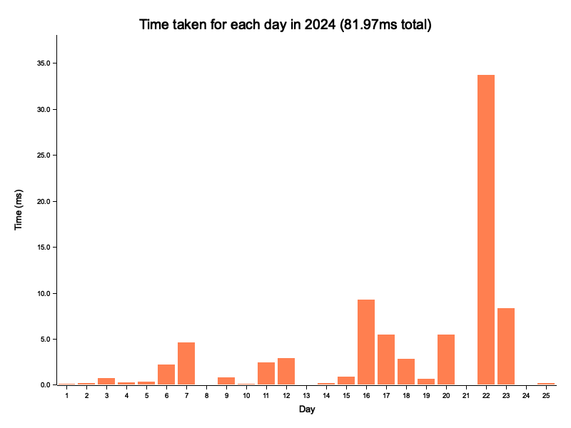

# Advent of Code

This repo has my solutions to Advent of Code, written in Rust. 

I've tried to write idiomatic, readable code. I attempt to make my code fast, but if it's a choice between fast and readable, I choose readable. No `unsafe` code or SIMD here.

That said, the code is pretty fast. My solutions for 2024 run in 82ms total. I've written in detail about the optimisations I've used to make my solutions faster - [Optimising my Rust solutions for Advent of Code](https://nindalf.com/posts/optimising-rust/). These tips are general and could be applied to most Rust programs.



## Benchmarks

Successfully completed problems with the time taken to execute them on my M1 Pro.

### 2024

| Day  | Problem     | Solution    | Part 1 (ms) | Part 2 (ms) | Total (ms) |
|------|-------------|-------------|-------------|-------------|------------|
| 1 | [Historian Hysteria](https://adventofcode.com/2024/day/1) | [Solution](/y2024/src/day1/mod.rs) | 0.05 | 0.04 | 0.09 |
| 2 | [Red-Nosed Reports](https://adventofcode.com/2024/day/2) | [Solution](/y2024/src/day2/mod.rs) | 0.09 | 0.09 | 0.18 |
| 3 | [Mull It Over](https://adventofcode.com/2024/day/3) | [Solution](/y2024/src/day3/mod.rs) | 0.37 | 0.37 | 0.73 |
| 4 | [Ceres Search](https://adventofcode.com/2024/day/4) | [Solution](/y2024/src/day4/mod.rs) | 0.18 | 0.10 | 0.27 |
| 5 | [Print Queue](https://adventofcode.com/2024/day/5) | [Solution](/y2024/src/day5/mod.rs) | 0.16 | 0.16 | 0.32 |
| 6 | [Guard Gallivant](https://adventofcode.com/2024/day/6) | [Solution](/y2024/src/day6/mod.rs) | 0.09 | 2.09 | 2.19 |
| 7 | [Bridge Repair](https://adventofcode.com/2024/day/7) | [Solution](/y2024/src/day7/mod.rs) | 0.17 | 3.76 | 3.94 |
| 8 | [Resonant Collinearity](https://adventofcode.com/2024/day/8) | [Solution](/y2024/src/day8/mod.rs) | 0.02 | 0.04 | 0.06 |
| 9 | [Disk Fragmenter](https://adventofcode.com/2024/day/9) | [Solution](/y2024/src/day9/mod.rs) | 0.23 | 0.55 | 0.78 |
| 10 | [Hoof It](https://adventofcode.com/2024/day/10) | [Solution](/y2024/src/day10/mod.rs) | 0.07 | 0.06 | 0.13 |
| 11 | [Plutonian Pebbles](https://adventofcode.com/2024/day/11) | [Solution](/y2024/src/day11/mod.rs) | 0.04 | 2.43 | 2.47 |
| 12 | [Garden Groups](https://adventofcode.com/2024/day/12) | [Solution](/y2024/src/day12/mod.rs) | 1.04 | 1.83 | 2.88 |
| 13 | [Claw Contraption](https://adventofcode.com/2024/day/13) | [Solution](/y2024/src/day13/mod.rs) | 0.03 | 0.03 | 0.06 |
| 14 | [Restroom Redoubt](https://adventofcode.com/2024/day/14) | [Solution](/y2024/src/day14/mod.rs) | 0.03 | 0.17 | 0.20 |
| 15 | [Warehouse Woes](https://adventofcode.com/2024/day/15) | [Solution](/y2024/src/day15/mod.rs) | 0.37 | 0.53 | 0.91 |
| 16 | [Reindeer Maze](https://adventofcode.com/2024/day/16) | [Solution](/y2024/src/day16/mod.rs) | 3.18 | 6.11 | 9.29 |
| 17 | [Chronospatial Computer](https://adventofcode.com/2024/day/17) | [Solution](/y2024/src/day17/mod.rs) | 0.00 | 5.43 | 5.43 |
| 18 | [RAM Run](https://adventofcode.com/2024/day/18) | [Solution](/y2024/src/day18/mod.rs) | 0.48 | 2.33 | 2.80 |
| 19 | [Linen Layout](https://adventofcode.com/2024/day/19) | [Solution](/y2024/src/day19/mod.rs) | 0.35 | 0.33 | 0.67 |
| 20 | [Race Condition](https://adventofcode.com/2024/day/20) | [Solution](/y2024/src/day20/mod.rs) | 0.62 | 4.86 | 5.49 |
| 21 | [Keypad Conundrum](https://adventofcode.com/2024/day/21) | [Solution](/y2024/src/day21/mod.rs) | 0.01 | 0.06 | 0.07 |
| 22 | [Monkey Market](https://adventofcode.com/2024/day/22) | [Solution](/y2024/src/day22/mod.rs) | 1.29 | 32.41 | 33.70 |
| 23 | [LAN Party](https://adventofcode.com/2024/day/23) | [Solution](/y2024/src/day23/mod.rs) | 0.41 | 7.96 | 8.36 |
| 24 | [Crossed Wires](https://adventofcode.com/2024/day/24) | [Solution](/y2024/src/day24/mod.rs) | 0.03 | 0.05 | 0.07 |
| 25 | [Code Chronicle](https://adventofcode.com/2024/day/25) | [Solution](/y2024/src/day25/mod.rs) | 0.18 | 0.00 | 0.18 |
|  |  | Total | 9.49ms | 71.80ms | 81.29ms |


## Setup

1. Clone this repo - `gh repo clone nindalf/advent` or `git clone git@github.com:nindalf/advent.git`.
2. Install [Rust](https://www.rust-lang.org/learn/get-started) or update - `rustup update`.
3. Install [just](https://just.systems), the command runner.
4. Install [aocgen](https://github.com/nindalf/aocgen), which fetches the problem input and creates the empty files.

## How to use

Run `just` for all the available commands.

By default `just` will run these for the latest year, set by the env variable `AOC_YEAR`.

```
just fetch 15         # fetches the 15th day's problem and input.

just test 15 1_t      # runs day15::tests::part1_test
just test 15 1_r      # runs day15::tests::part1_real
just test 15 1        # runs both tests for day 15 part 1
just test 15 2        # runs both tests for day 15 part 2
just test 15          # runs all 4 tests for day 15

just submit 15 1 1024 # Submit "1024" as the solution for Day 15 Part 1
just submit 15 2 2048 # Submit "2048" as the solution for Day 15 Part 2

just bench 15         # benchmarks day 15 parts 1 and 2
```

`just test`/`just bench` with no arguments runs all the tests/benchmarks for the latest year.

### Overriding `AOC_YEAR`

If `AOC_YEAR` is not set, it picks up the default from the `justfile`. To run the commands for a different year, you can choose one of these options:

- Set it permanently
  - Set the env variable - `export AOC_YEAR=2023`
  - Change the default in the `justfile` - `AOC_YEAR := env_var_or_default("AOC_YEAR", "2023")`
- Set it for one invocation
  - `AOC_YEAR=2023 just test` OR
  - `just --set AOC_YEAR 2023 test`
